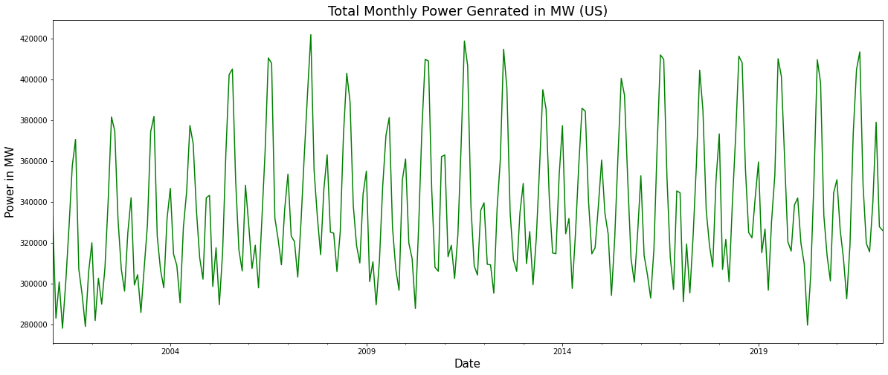

# Electricity-Production-US-Time-Series
Time Series Analysis and Forecasting of US Power Production

 
 
### Power Generated in MW from 2001 to 2022

 
 

### Seasonality in Data

### Correlation

 
 

### Forecasted and Actual Data

